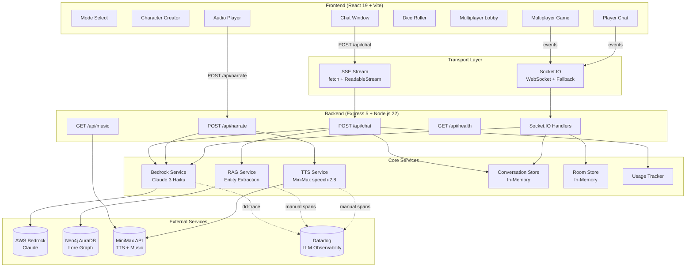
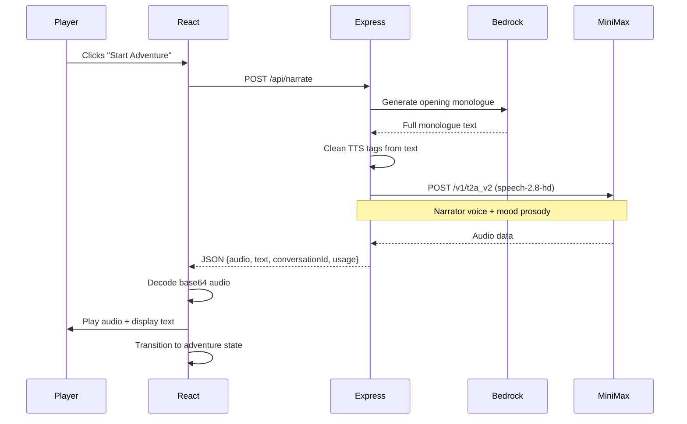
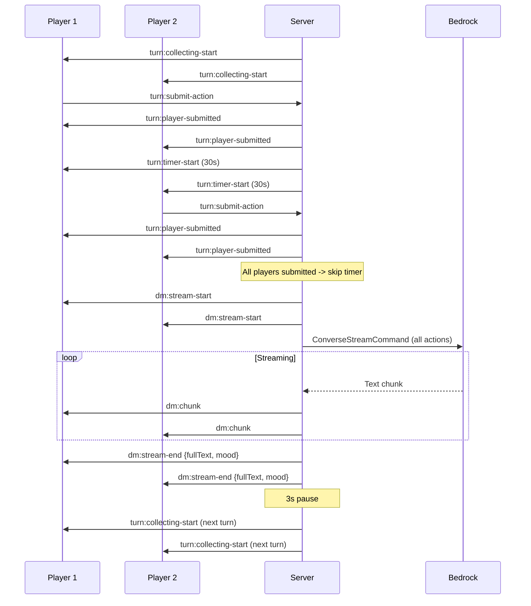
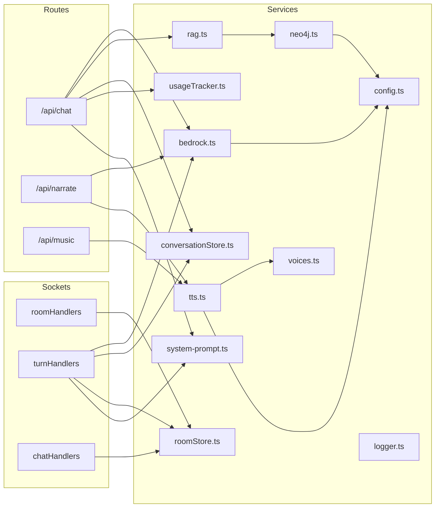
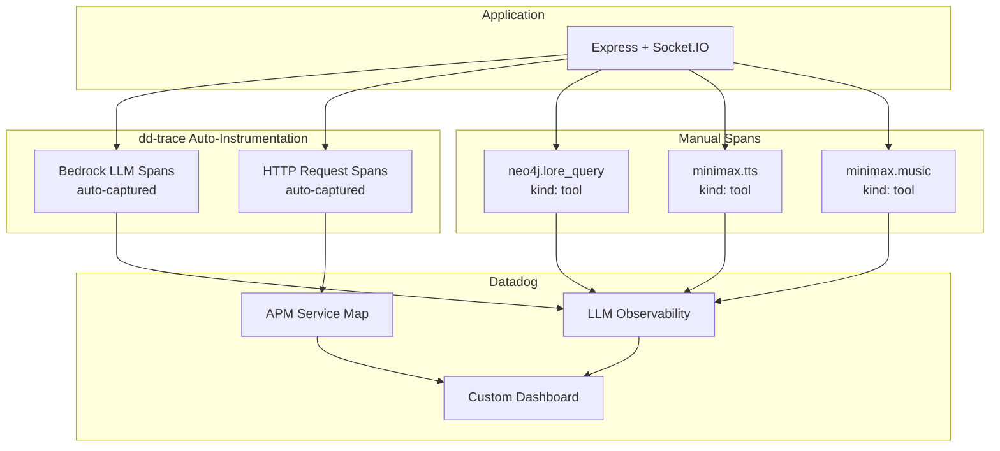

# Architecture Documentation

## System Architecture



---

## Data Flow Diagrams

### Single-Player Chat Flow

```mermaid
sequenceDiagram
    participant Player
    participant React
    participant Express
    participant RAG
    participant Neo4j
    participant Bedrock
    participant Datadog

    Player->>React: Types message, clicks Send
    React->>Express: POST /api/chat (SSE)
    Express->>Express: Get/create conversation
    Express->>Express: Append user message to history

    Express->>RAG: buildLoreContext(message)
    RAG->>RAG: Extract entities (keyword match)
    RAG->>Neo4j: Cypher query (2-hop subgraph)
    Neo4j-->>RAG: Lore nodes
    RAG-->>Express: Formatted lore context

    Express->>Bedrock: ConverseStreamCommand
    Note over Express,Bedrock: System prompt + lore + history (last 12 turns)

    loop Streaming chunks
        Bedrock-->>Express: Text chunk
        Express-->>React: SSE data: {text}
        React->>React: Append to UI
    end

    Bedrock-->>Express: Stream complete
    Express-->>React: SSE data: {ttsText, mood}
    Express-->>React: SSE data: {usage}
    Express-->>React: SSE data: [DONE]
    Express->>Express: Persist assistant message

    Express-.>>Datadog: LLM span (auto-instrumented)
    RAG-.>>Datadog: tool span (manual)
```

### Opening Monologue Flow



### Multiplayer Turn Cycle



---

## Component Architecture

### Frontend Component Tree

```
App (state machine: modeSelect -> classSelect -> adventure | multiplayerLobby -> multiplayerGame)
  |
  +-- ModeSelect                    # Single Player / Multiplayer choice
  |
  +-- ClassSelect                   # Character creation (class + gender + pronouns)
  |
  +-- AudioPlayer                   # Opening monologue audio playback
  |
  +-- ChatWindow                    # Single-player DM conversation
  |     +-- MessageBubble[]         # Styled message (DM/player/dice)
  |
  +-- MessageInput                  # Text input + send button
  |
  +-- DiceRoller                    # Animated d20 roller
  |
  +-- AudioControls                 # Volume slider + play/pause
  |
  +-- MultiplayerLobby             # Room create/join + player roster + ready
  |
  +-- MultiplayerGame              # Active multiplayer gameplay
        +-- PlayerStatusBar[]       # Per-player status (class, gender, connected)
        +-- PlayerChat              # Player-to-player sidebar chat
        +-- DiceRoller              # Shared dice roller
```

### Backend Service Dependency Graph



---

## Key Design Decisions

### 1. SSE for Single-Player, Socket.IO for Multiplayer

**Decision:** Use `fetch` + `ReadableStream` SSE parsing for single-player chat; Socket.IO WebSockets for multiplayer.

**Rationale:**
- SSE is simpler and browser-native for unidirectional streaming (DM -> player)
- Socket.IO provides bidirectional real-time communication needed for multiplayer (turn submission, player chat, presence)
- Avoids mixing transport layers unnecessarily

### 2. Server-Owned Conversation State

**Decision:** The server is the source of truth for all conversation history. The client sends `{ conversationId, message }` and receives streamed responses.

**Rationale:**
- Prevents client-side prompt tampering
- Centralizes token budget management (windowed history: last 12 turns)
- Enables server-side lore injection without exposing RAG internals

### 3. In-Memory Stores (Not Redis)

**Decision:** Conversation and room state stored in-memory (`Map` objects) rather than Redis.

**Rationale:**
- Sufficient for ~1000 concurrent users on a single instance
- Zero infrastructure dependency for development
- Redis planned for Phase 9 (Scale & Auth) for multi-instance deployment

**Trade-off:** State is lost on server restart. Acceptable for current scope.

### 4. Keyword-Based Entity Extraction (Not LLM)

**Decision:** RAG entity extraction uses keyword/alias matching against a known entity list, not an LLM call.

**Rationale:**
- ~20 node graph with known entities makes keyword matching sufficient
- Avoids an extra LLM round-trip per request (saves 1-3s latency)
- Deterministic and cacheable (sha256 hash of sorted entity set)

### 5. TTS on Opening Monologue Only

**Decision:** MiniMax TTS generates audio only for the opening narration, not every DM turn.

**Rationale:**
- TTS adds 3-6s latency per generation
- Turn-by-turn TTS would break conversational flow
- Opening monologue is a cinematic moment where the latency is acceptable
- Multiplayer DM responses use `dm:tts-ready` event (optional, non-blocking)

### 6. Bedrock SDK Choice

**Decision:** Use `@aws-sdk/client-bedrock-runtime`, NOT `@anthropic-ai/bedrock-sdk`.

**Rationale:**
- Datadog `dd-trace` only auto-instruments the AWS SDK
- Using the Anthropic wrapper would produce zero LLM traces in Datadog
- This is a hard requirement for the observability story

### 7. dd-trace Bootstrap via NODE_OPTIONS

**Decision:** Load dd-trace via `NODE_OPTIONS='--import dd-trace/initialize.mjs'` before any application code.

**Rationale:**
- dd-trace uses monkey-patching to instrument modules
- If loaded after other modules, patches don't apply and traces are silently missing
- `NODE_OPTIONS` guarantees dd-trace loads first regardless of import order

---

## Reliability Patterns

| Pattern | Implementation |
|---------|---------------|
| **Bedrock timeout** | 45s AbortSignal on ConverseStreamCommand |
| **Neo4j graceful degradation** | RAG returns empty string on failure; chat continues without lore |
| **TTS non-blocking** | TTS failures return text-only response; audio is optional |
| **Connection recovery** | Socket.IO `maxDisconnectionDuration: 120000` (2min auto-reconnect) |
| **Music retry** | 3 max retries, 30s cooldown between failures per mood |
| **Cache layers** | TTS cache (sha256, 30min TTL, 200 max), Lore cache (sha256, 10min TTL, 100 max) |
| **Windowed history** | Last 12 turns sent to Bedrock (~500 tokens/turn budget) |
| **Auto-fill actions** | Players who don't submit in 30s get "waits and observes" |

---

## Security Considerations

| Concern | Status | Plan |
|---------|--------|------|
| Authentication | Not implemented | Phase 9: login/session management |
| CORS | Dev: Vite proxy (all origins) | Production: strict allowlist |
| Body size limits | Configured in Express | Prevents payload abuse |
| Rate limiting | Not implemented | Phase 9: per-user on `/chat` and `/narrate` |
| Secrets | Server-side only (`.env`) | Never exposed to client |
| Prompt injection | System prompt hardening | Input sanitization on user messages |
| Socket auth | Not implemented | Phase 9: token-based socket auth |

---

## Observability Stack



**Required Environment Variables for Tracing:**

```bash
DD_LLMOBS_ENABLED=1
DD_LLMOBS_ML_APP=ai-dm
DD_API_KEY=<your-key>
DD_LLMOBS_AGENTLESS_ENABLED=1
DD_SITE=datadoghq.com
DD_TRACE_AWS_SDK_BEDROCKRUNTIME_ENABLED=true
```
